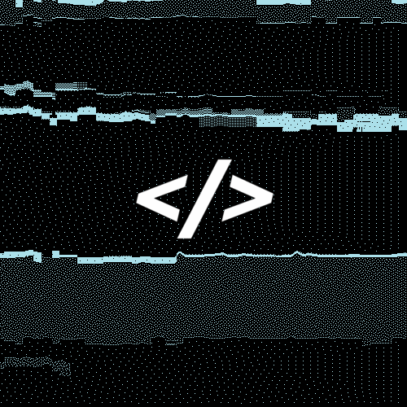

  

  
  
  

 

<h2 align="center">  <em>About  me </em></h2>

 

  Hello There! <em><b>I'm Kalidas</b></em>, a Game Developer and Software Developer passionate about building interactive and creative experiences. I primarily work with Unreal Engine, Unity, Python, and C++ to develop games and software.  
  I'm also exploring sound design and music production, with knowledge in cybersecurity.  
  Open to collaborating on games, software, open-source, and creative projects. Always learning, building, and sharing knowledge.  
  <strong>Interests:</strong> games, music, fitness, and magic.

 

  <a href="https://portfolio-mocha-eight-35.vercel.app/" target="_blank">
    
    Portfolio
  </a>

 
 
<h2 align="center">  <em> Typing Stats </em> </h2>

  <a href="https://monkeytype.com/profile/Kalidaskj"  /> monkeytype
  </a>

 
 
<h2 align="center">  <em> Technologies </em> </h2>

<h3 align="center"><em>Languages</em></h3>

  
  
  
  
  
  
  

<h3 align="center"><em>Frontend</em></h3>

  
  
  
  
  

<h3 align="center"><em>Backend</em></h3>

  
  

<h3 align="center"><em>Databases</em></h3>

  
  

<h3 align="center"><em>DevOps & Cloud</em></h3>

  
  
  
  
  
  
   
  
  
  

<h3 align="center"><em>Tools & IDEs</em></h3>

  
  
  
  

<h3 align="center"><em>Operating Systems</em></h3>

  
  
  
  
  

<h3 align="center"><em>Testing</em></h3>

  
  
  
  
  

<h3 align="center"><em>Other</em></h3>

  

 

<h2 align="center"">  <em> Statistics </em> </h2>

 

